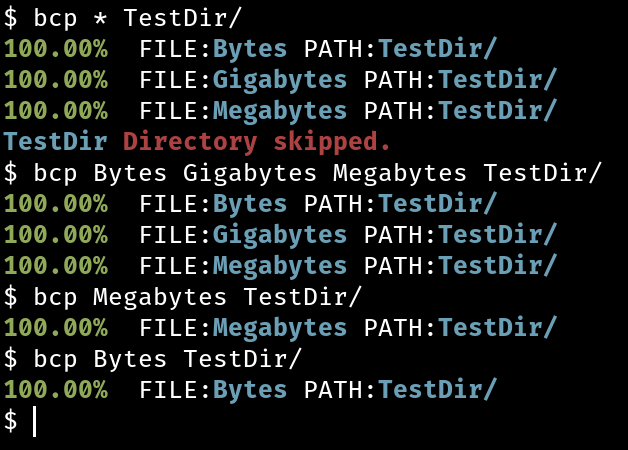

# BeautifulCopy

#### 📥Download
```bash
git clone https://github.com/massabsorb/BeautifulCopy.git
```

#### 🔨Build
```bash
cd BeautifulCopy
```
```bash
make
```

> For better experience:
```bash
sudo mv bcp /usr/bin/
```

#### 🧑‍💻Usage
You can copy one file per one usage:
```bash
bcp ~/file /destiny/path/
```
Also you can copy several files like this:
```bash
bcp ~/file1 ~/file2 ~/file3 /destiny/path/
```
Or you can copy **ALL** files from the directory:
```bash
bcp ~/* /usr/share/
```
### 🚀Executing

